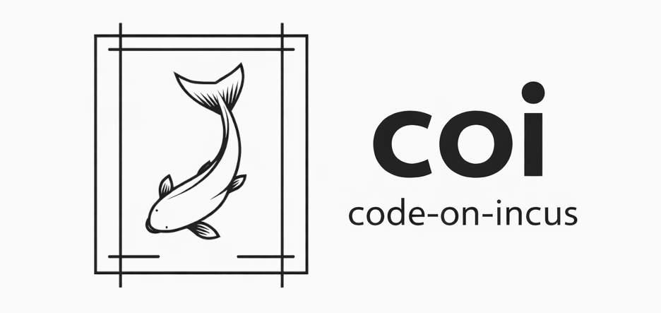

<p align="center">
  
</p>

# claude-code-isolated (`cci`)

[](https://opensource.org/licenses/MIT)
[](https://golang.org/)
[](https://github.com/thomas/claude-code-isolated/releases)

**Secure and Fast Container Runtime for Claude Code on Linux**

Run Claude Code in isolated, production-grade Incus containers with zero permission headaches, perfect file ownership, and true multi-session support.

**Security First:** Unlike Docker or bare-metal execution, your environment variables, SSH keys, and Git credentials are **never** exposed to Claude Code. Containers run in complete isolation with no access to your host credentials unless explicitly mounted.

*Think Docker for Claude Code, but with system containers that actually work like real machines.*


## Features

**Core Capabilities**
- Multi-slot support - Run parallel Claude Code sessions for the same workspace with full isolation
- Session resume - Resume conversations with full history and credentials restored (workspace-scoped)
- Persistent containers - Keep containers alive between sessions (installed tools preserved)
- Workspace isolation - Each session mounts your project directory
- **Slot isolation** - Each parallel slot has its own home directory (files don't leak between slots)
- **Workspace files persist even in ephemeral mode** - Only the container is deleted, your work is always saved

**Security & Isolation**
- Automatic UID mapping - No permission hell, files owned correctly
- System containers - Full security isolation, better than Docker privileged mode
- Project separation - Complete isolation between workspaces
- **Credential protection** - No risk of SSH keys, `.env` files, or Git credentials being exposed to Claude Code

**Safe Dangerous Operations**
- Claude Code often needs broad filesystem access or bypass permission checks
- **These operations are safe inside containers** because the "root" is the container root, not your host system
- Containers are ephemeral - any changes are contained and don't affect your host
- This gives Claude Code full capabilities while keeping your system protected

## Quick Start

```bash
# Install
curl -fsSL https://raw.githubusercontent.com/thomas/claude-code-isolated/master/install.sh | bash

# Build image (first time only, ~5-10 minutes)
cci build

# Start Claude Code in an isolated container
cd your-project
cci shell

# That's it! Claude Code is now running in an isolated container with:
# - Your project mounted at /workspace
# - Correct file permissions (no more chown!)
# - Full Docker access inside the container
# - GitHub CLI available for PR/issue management
# - All workspace changes persisted automatically
# - No access to your host SSH keys, env vars, or credentials
```


## Why Incus Over Docker?

### What is Incus?

Incus is a modern Linux container and virtual machine manager, forked from LXD. Unlike Docker (which uses application containers), Incus provides **system containers** that behave like lightweight VMs with full init systems.

### Key Differences

| Feature | **claude-code-isolated (Incus)** | Docker |
|---------|---------------------------|--------|
| **Container Type** | System containers (full OS) | Application containers |
| **Init System** | Full systemd/init | No init (single process) |
| **UID Mapping** | Automatic UID shifting | Manual mapping required |
| **Security** | Unprivileged by default | Often requires privileged mode |
| **File Permissions** | Preserved (UID shifting) | Host UID conflicts |
| **Startup Time** | ~1-2 seconds | ~0.5-1 second |
| **Docker-in-Container** | Native support | Requires DinD hacks |

### Benefits

**No Permission Hell** - Incus automatically maps container UIDs to host UIDs. Files created by Claude Code in-container have correct ownership on host. No `chown` needed.

**True Isolation** - Full system container means Claude Code can run Docker, systemd services, etc. Safer than Docker's privileged mode.

**Persistent State** - System containers can be stopped/started without data loss. Ideal for long-running Claude Code sessions.

**Resource Efficiency** - Share kernel like Docker, lower overhead than VMs, better density for parallel sessions.

## Installation

### Automated Installation (Recommended)

```bash
# One-shot install
curl -fsSL https://raw.githubusercontent.com/thomas/claude-code-isolated/master/install.sh | bash

# This will:
# - Download and install cci to /usr/local/bin
# - Check for Incus installation
# - Verify you're in incus-admin group
# - Show next steps
```

### Manual Installation

For users who prefer to verify each step or cannot use the automated installer:

**Prerequisites:**

1. **Linux OS** - Only Linux is supported (Incus is Linux-only)
   - Supported architectures: x86_64/amd64, aarch64/arm64

2. **Incus installed and initialized**
   ```bash
   # Ubuntu/Debian
   sudo apt update
   sudo apt install -y incus
   sudo incus admin init --auto
   ```
   See [Incus installation guide](https://linuxcontainers.org/incus/docs/main/installing/) for other distributions.

3. **User in incus-admin group**
   ```bash
   sudo usermod -aG incus-admin $USER
   # Log out and back in for group changes to take effect
   ```

**Installation Steps:**

1. **Download the binary** for your platform:
   ```bash
   # For x86_64/amd64
   curl -fsSL -o cci https://github.com/thomas/claude-code-isolated/releases/latest/download/cci-linux-amd64

   # For aarch64/arm64
   curl -fsSL -o cci https://github.com/thomas/claude-code-isolated/releases/latest/download/cci-linux-arm64
   ```

2. **Verify the download** (optional but recommended):
   ```bash
   # Check file size and type
   ls -lh cci
   file cci
   ```

3. **Install the binary**:
   ```bash
   chmod +x cci
   sudo mv cci /usr/local/bin/
   sudo ln -sf /usr/local/bin/cci /usr/local/bin/claude-code-isolated
   ```

4. **Verify installation**:
   ```bash
   cci --version
   ```

**Alternative: Build from Source**

If you prefer to build from source or need a specific version:

```bash
# Prerequisites: Go 1.24.4 or later
git clone https://github.com/thomas/claude-code-isolated.git
cd claude-code-isolated
make build
sudo make install
```

**Post-Install Setup:**

1. **Optional: Set up ZFS for instant container creation**
   ```bash
   # Install ZFS (may not be available for all kernels)
   sudo apt-get install -y zfsutils-linux

   # Create ZFS storage pool (50GiB)
   sudo incus storage create zfs-pool zfs size=50GiB

   # Configure default profile to use ZFS
   incus profile device set default root pool=zfs-pool
   ```

   This reduces container startup time from 5-10s to ~50ms. If ZFS is not available, containers will use default storage (slower but fully functional).

2. **Verify group membership** (must be done in a new shell/login):
   ```bash
   groups | grep incus-admin
   ```

**Troubleshooting:**

- **"Permission denied" errors**: Ensure you're in the `incus-admin` group and have logged out/in
- **"incus: command not found"**: Install Incus following the [official guide](https://linuxcontainers.org/incus/docs/main/installing/)
- **Cannot download binary**: Check your internet connection and GitHub access, or build from source

### Build Images

```bash
# Build the unified cci image (5-10 minutes)
cci build

# Custom image from your own build script
cci build custom my-rust-image --script build-rust.sh
cci build custom my-image --base cci --script setup.sh
```

**What's included in the `cci` image:**
- Ubuntu 22.04 base
- Docker (full Docker-in-container support)
- Node.js 20 + npm
- Claude Code CLI
- GitHub CLI (`gh`)
- tmux for session management
- Common build tools (git, curl, build-essential, etc.)

**Custom images:** Build your own specialized images using build scripts that run on top of the base `cci` image.

## Usage

### Basic Commands

```bash
# Start Claude Code session
cci shell

# Persistent mode - keep container between sessions
cci shell --persistent

# Use specific slot for parallel sessions
cci shell --slot 2

# Resume previous session (auto-detects latest for this workspace)
cci shell --resume

# Resume specific session by ID
cci shell --resume=<session-id>

# Attach to existing session
cci attach

# List active containers and saved sessions
cci list --all

# Gracefully shutdown specific container (60s timeout)
cci shutdown cci-abc12345-1

# Shutdown with custom timeout
cci shutdown --timeout=30 cci-abc12345-1

# Shutdown all containers
cci shutdown --all

# Force kill specific container (immediate)
cci kill cci-abc12345-1

# Kill all containers
cci kill --all

# Cleanup stopped/orphaned containers
cci clean
```

### Global Flags

```bash
--workspace PATH       # Workspace directory to mount (default: current directory)
--slot NUMBER          # Slot number for parallel sessions (0 = auto-allocate)
--persistent           # Keep container between sessions
--resume [SESSION_ID]  # Resume from session (omit ID to auto-detect latest for workspace)
--continue [SESSION_ID] # Alias for --resume
--profile NAME         # Use named profile
--image NAME           # Use custom image (default: cci)
--env KEY=VALUE        # Set environment variables
--storage PATH         # Mount persistent storage
```

### Container Management

```bash
# List all containers and sessions
cci list --all

# Machine-readable JSON output (for programmatic use)
cci list --format=json
cci list --all --format=json

# Output shows container mode:
#   cci-abc12345-1 (ephemeral)   - will be deleted on exit
#   cci-abc12345-2 (persistent)  - will be kept for reuse

# Kill specific container (stop and delete)
cci kill <container-name>

# Kill multiple containers
cci kill <container1> <container2>

# Kill all containers (with confirmation)
cci kill --all

# Kill all without confirmation
cci kill --all --force

# Clean up stopped/orphaned containers
cci clean
cci clean --force  # Skip confirmation
```

### Advanced Container Operations

Low-level container commands for advanced use cases:

```bash
# Launch a new container
cci container launch cci my-container
cci container launch cci my-container --ephemeral

# Start/stop/delete containers
cci container start my-container
cci container stop my-container
cci container stop my-container --force
cci container delete my-container
cci container delete my-container --force

# Execute commands in containers
cci container exec my-container -- ls -la /workspace
cci container exec my-container --user 1000 --env FOO=bar --cwd /workspace -- npm test

# Capture output in different formats
cci container exec my-container --capture -- echo "hello"  # JSON output (default)
cci container exec my-container --capture --format=raw -- pwd  # Raw stdout (for scripting)

# Check container status
cci container exists my-container
cci container running my-container

# Mount directories
cci container mount my-container workspace /home/user/project /workspace --shift
```

### File Transfer

Transfer files and directories between host and containers:

```bash
# Push files/directories into a container
cci file push ./config.json my-container:/workspace/config.json
cci file push -r ./src my-container:/workspace/src

# Pull files/directories from a container
cci file pull my-container:/workspace/build.log ./build.log
cci file pull -r my-container:/root/.claude ./saved-sessions/session-123/
```

### Tmux Automation

Interact with running Claude Code sessions for automation workflows:

```bash
# List all active tmux sessions
cci tmux list

# Send commands/prompts to a running session
cci tmux send cci-abc12345-1 "write a hello world script"
cci tmux send cci-abc12345-1 "/exit"

# Capture current output from a session
cci tmux capture cci-abc12345-1
```

**Note:** Sessions use tmux internally, so standard tmux commands work after attaching with `cci attach`.

### Image Management

Advanced image operations:

```bash
# List images with filters
cci image list                           # List CCI images
cci image list --all                     # List all local images
cci image list --prefix claudeyard-      # Filter by prefix
cci image list --format json             # JSON output

# Publish containers as images
cci image publish my-container my-custom-image --description "Custom build"

# Delete images
cci image delete my-custom-image

# Check if image exists
cci image exists cci

# Clean up old image versions
cci image cleanup claudeyard-node-42- --keep 3
```

## Session Resume

Session resume allows you to continue a previous Claude Code session with full history and credentials restored.

**Usage:**
```bash
# Auto-detect and resume latest session for this workspace
cci shell --resume

# Resume specific session by ID
cci shell --resume=<session-id>

# Alias: --continue works the same
cci shell --continue

# List available sessions
cci list --all
```

**What's Restored:**
- Full conversation history from previous session
- Tool credentials and authentication (no re-authentication needed)
- User settings and preferences
- Project context and conversation state

**How It Works:**
- After each session, tool state directory (e.g., `.claude`) is automatically saved to `~/.cci/sessions-<tool>/`
- On resume, session data is restored to the container before the tool starts
- Fresh credentials are injected from your host config directory
- Claude Code automatically continues from where you left off

**Workspace-Scoped Sessions:**
- `--resume` only looks for sessions from the **current workspace directory**
- Sessions from other workspaces are never considered (security feature)
- This prevents accidentally resuming a session with a different project context
- Each workspace maintains its own session history

**Note:** Resume works for both ephemeral and persistent containers. For ephemeral containers, the container is recreated but the conversation continues seamlessly.

## Persistent Mode

By default, containers are **ephemeral** (deleted on exit). Your **workspace files always persist** regardless of mode.

Enable **persistent mode** to also keep the container and its installed packages:

**Via CLI:**
```bash
cci shell --persistent
```

**Via config (recommended):**
```toml
# ~/.config/cci/config.toml
[defaults]
persistent = true
```

**Benefits:**
- Install once, use forever - `apt install`, `npm install`, etc. persist
- Faster startup - Reuse existing container instead of rebuilding
- Build artifacts preserved - No re-compiling on each session

**What persists:**
- **Ephemeral mode:** Workspace files + session data (container deleted)
- **Persistent mode:** Workspace files + session data + container state + installed packages

## Configuration

Config file: `~/.config/cci/config.toml`

```toml
[defaults]
image = "cci"
persistent = true
mount_claude_config = true

[tool]
name = "claude"  # Claude Code configuration
# binary = "claude"  # Optional: override binary name

[paths]
# Note: sessions_dir is deprecated - sessions are now stored in ~/.cci/sessions-claude/
sessions_dir = "~/.cci/sessions"  # Legacy path (not used for new sessions)
storage_dir = "~/.cci/storage"

[incus]
project = "default"
group = "incus-admin"
claude_uid = 1000

[profiles.rust]
image = "cci-rust"
environment = { RUST_BACKTRACE = "1" }
persistent = true
```

**Configuration hierarchy** (highest precedence last):
1. Built-in defaults
2. System config (`/etc/cci/config.toml`)
3. User config (`~/.config/cci/config.toml`)
4. Project config (`./.cci.toml`)
5. CLI flags


## Container Lifecycle & Session Persistence

Understanding how containers and sessions work in `cci`:

### How It Works Internally

1. **Containers are always launched as non-ephemeral** (persistent in Incus terms)
   - This allows saving session data even if the container is stopped from within (e.g., `sudo shutdown 0`)
   - Session data can be pulled from stopped containers, but not from deleted ones

2. **Inside the container**: `tmux` → `bash` → `claude`
   - When Claude Code exits, you're dropped to bash
   - From bash you can: type `exit`, press `Ctrl+b d` to detach, or run `sudo shutdown 0`

3. **On cleanup** (when you exit/detach):
   - Session data (tool config directory) is **always** saved to `~/.cci/sessions-<tool>/`
   - If `--persistent` was NOT set: container is deleted after saving
   - If `--persistent` was set: container is kept for reuse

### What Gets Preserved

| Mode | Workspace Files | Claude Code Session | Container State |
|------|----------------|-----------------|-----------------|
| **Default (ephemeral)** | Always saved | Always saved | Deleted |
| **`--persistent`** | Always saved | Always saved | Kept |

### Session vs Container Persistence

- **`--resume`**: Restores the **Claude Code conversation** in a fresh container
  - Use when you want to continue a conversation but don't need installed packages
  - Container is recreated, only tool session data is restored
  - **Workspace-scoped**: Only finds sessions from the current workspace directory (security feature)

- **`--persistent`**: Keeps the **entire container** with all modifications
  - Use when you've installed tools, built artifacts, or modified the environment
  - `cci attach` reconnects to the same container with everything intact

### Stopping Containers

From **inside** the container:
- `exit` in bash → exits bash but keeps container running (use for temporary shell exit)
- `Ctrl+b d` → detaches from tmux, container stays running
- `sudo shutdown 0` or `sudo poweroff` → stops container, session is saved, then container is deleted (or kept if `--persistent`)

From **outside** (host):
- `cci shutdown <name>` → graceful stop with session save, then delete (60s timeout by default)
- `cci shutdown --timeout=30 <name>` → graceful stop with 30s timeout
- `cci shutdown --all` → graceful stop all containers (with confirmation)
- `cci shutdown --all --force` → graceful stop all without confirmation
- `cci kill <name>` → force stop and delete immediately
- `cci kill --all` → force stop and delete all containers (with confirmation)
- `cci kill --all --force` → force stop all without confirmation

### Example Workflows

**Quick task (default mode):**
```bash
cci shell                    # Start Claude Code session
# ... work with Claude Code ...
sudo poweroff                # Shutdown container → session saved, container deleted
cci shell --resume           # Continue conversation in fresh container
```

**Note:** `exit` in bash keeps the container running - use `sudo poweroff` or `sudo shutdown 0` to properly end the session. Both require sudo but no password.

**Long-running project (`--persistent`):**
```bash
cci shell --persistent       # Start persistent session
# ... install tools, build things ...
# Press Ctrl+b d to detach
cci attach                   # Reconnect to same container with all tools
sudo poweroff                # When done, shutdown and save
cci shell --persistent --resume  # Resume with all installed tools intact
```

**Parallel sessions (multi-slot):**
```bash
# Terminal 1: Start first session (auto-allocates slot 1)
cci shell
# ... working on feature A ...
# Press Ctrl+b d to detach (container stays running)

# Terminal 2: Start second session (auto-allocates slot 2)
cci shell
# ... working on feature B in parallel ...

# Both sessions share the same workspace but have isolated:
# - Home directories (~/slot1_file won't appear in slot 2)
# - Installed packages
# - Running processes
# - Claude Code conversation history

# List both running sessions
cci list
#   cci-abc12345-1 (ephemeral)
#   cci-abc12345-2 (ephemeral)

# When done, shutdown all sessions
cci shutdown --all
```

## Network Isolation

CCI provides network isolation to protect your host and private networks from container access.

### Network Modes

**Restricted mode (default)** - Blocks local networks, allows internet:
```bash
cci shell  # Default behavior
```
- Blocks: RFC1918 private networks (10.0.0.0/8, 172.16.0.0/12, 192.168.0.0/16)
- Blocks: Cloud metadata endpoints (169.254.0.0/16)
- Allows: All public internet (npm, pypi, GitHub, APIs, etc.)

**Allowlist mode** - Only specific domains allowed:
```bash
cci shell --network=allowlist
```
- Requires configuration with `allowed_domains` list
- DNS resolution with automatic IP refresh every 30 minutes
- Always blocks RFC1918 private networks
- IP caching for DNS failure resilience

**Open mode** - No restrictions (trusted projects only):
```bash
cci shell --network=open
```

### Configuration

```toml
# ~/.config/cci/config.toml
[network]
mode = "restricted"  # restricted | open | allowlist

# Allowlist mode configuration
# Supports both domain names and raw IPv4 addresses
allowed_domains = ["github.com", "api.anthropic.com", "8.8.8.8"]
refresh_interval_minutes = 30  # IP refresh interval (0 to disable)
```

**Important for allowlist mode:**
- Supports both domain names (`github.com`) and raw IPv4 addresses (`8.8.8.8`)
- Subdomains must be listed explicitly (`github.com` ≠ `api.github.com`)
- Domains behind CDNs may have many IPs that change frequently
- DNS failures use cached IPs from previous successful resolution
- To allow DNS resolution inside the container, add DNS server IPs (e.g., `8.8.8.8`)

## Troubleshooting

### DNS Issues During Build

**Symptom:** `cci build` hangs at "Still waiting for network..." even though the container has an IP address.

**Cause:** On Ubuntu systems with systemd-resolved, containers may receive `127.0.0.53` as their DNS server via DHCP. This is the host's stub resolver which only works on the host, not inside containers.

**Automatic Fix:** CCI automatically detects and fixes this issue during build by:
1. Detecting if DNS resolution fails but IP connectivity works
2. Injecting public DNS servers (8.8.8.8, 8.8.4.4, 1.1.1.1) into the container
3. The resulting image uses static DNS configuration

**Permanent Fix:** Configure your Incus network to provide proper DNS to containers:

```bash
# Option 1: Enable managed DNS (recommended)
incus network set incusbr0 dns.mode managed

# Option 2: Use public DNS servers
incus network set incusbr0 raw.dnsmasq "dhcp-option=6,8.8.8.8,8.8.4.4"
```

After applying either fix, future containers will have working DNS automatically.

**Note:** The automatic fix only affects the built image. Other Incus containers on your system may still experience DNS issues until you apply the permanent fix.

**Why doesn't CCI automatically run `incus network set` for me?**

CCI deliberately uses an in-container fix rather than modifying your Incus network configuration:

1. **System-level impact** - Changing Incus network settings affects all containers on that bridge, not just CCI containers
2. **Network name varies** - The bridge might not be named `incusbr0` on all systems
3. **Permissions** - Users running `cci build` might not have permission to modify Incus network settings
4. **Intentional configurations** - Some users have custom DNS configurations for their other containers
5. **Principle of least surprise** - Modifying system-level Incus config without explicit consent could break other setups

The in-container approach is self-contained and only affects CCI images, leaving your Incus configuration untouched.
